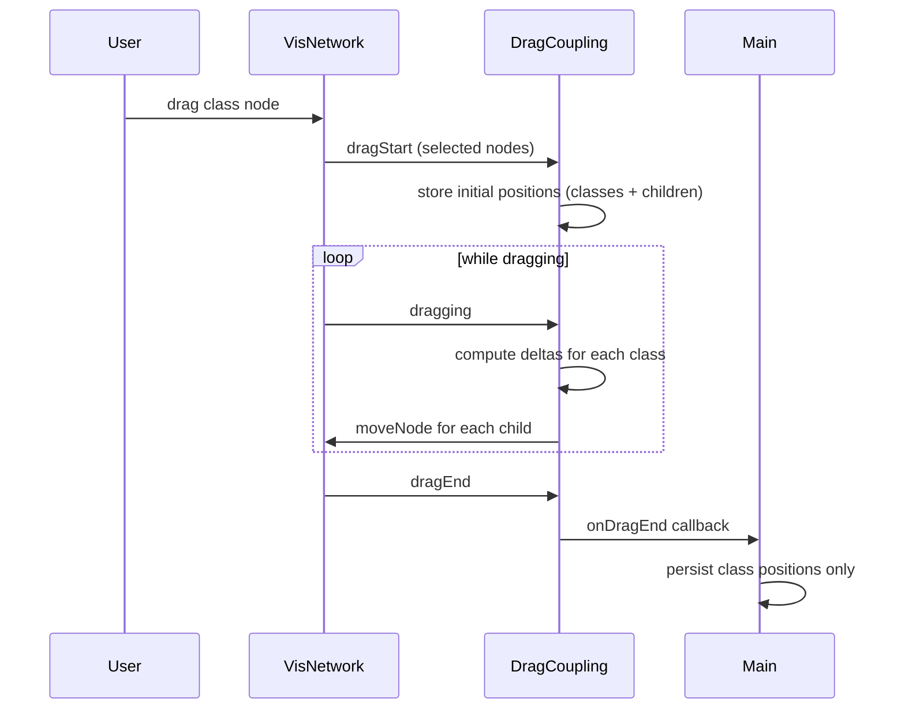

# Data property nodes move with parent class on drag

## Current behavior

- **Domain class nodes** live in `rawData.nodes`; positions are persisted in display config.
- **Data property nodes** are synthetic: IDs `__dataprop__${classId}__${propertyName}` and `__dataproprestrict__${classId}__${propertyName}`. They are created in `buildNetworkData` and positioned from the parent class; they are not in `rawData.nodes`.
- Only **dragEnd** is used in [main.ts](src/main.ts) (~6004–6014): it persists positions only for nodes in `rawData.nodes`, so only class positions are saved. Data property positions are never persisted and are recomputed on each rebuild.
- When the user drags a class, data property nodes do not move during the drag; they only get recomputed after the next rebuild.

## Target behavior

- When the user drags one or more **domain class** nodes (with or without other nodes selected), all **attached data property nodes** (both `__dataprop__` and `__dataproprestrict__`) for those classes move by the same delta during the drag.
- When the user drags only a **data property** (or restriction) node, only that node moves (no persistence required).
- No persistence of data property node positions (option A): after drop, only class positions are saved; on next rebuild, data property positions are recomputed from class positions.

## Architecture

## Implementation plan

### 1. New module: data property node ID helpers and drag coupling

**New file: [src/graph/dataPropertyDragCoupling.ts**](src/graph/dataPropertyDragCoupling.ts)

- **Pure helpers** (exported for unit tests and use in setup):
  - `isDomainClassNode(nodeId: string): boolean`  
  Return `true` iff `nodeId` does not start with `__dataprop__` or `__dataproprestrict__`. Used to treat only domain classes as “parents” for coupling.
  - `getAttachedDataPropertyNodeIds(classId: string, allNodeIds: Iterable<string>): string[]`  
  Return all node IDs that are attached to `classId`: match `__dataprop__${classId}__*` and `__dataproprestrict__${classId}__*` within `allNodeIds`.
- **Setup function**:  
`setupDragCoupling(network: Network, options: { onDragEnd: () => void }): void`
  - **dragStart**: Get selected node IDs via `network.getSelectedNodes()`. For each selected node that `isDomainClassNode(id)`, collect attached data property node IDs via `getAttachedDataPropertyNodeIds(id, Object.keys(network.getPositions()))`. Store a snapshot: `initialPositions: Record<string, { x, y }>` for all selected nodes and all collected child IDs (so we have initial positions for every class and every child that might need to be moved).
  - **dragging**: Get current positions with `network.getPositions()`. For each selected node that is a domain class, compute `delta = { dx: current.x - initial.x, dy: current.y - initial.y }`. For each attached data property node of that class, call `network.moveNode(childId, initialPositions[childId].x + dx, initialPositions[childId].y + dy)` so children follow the same delta. If multiple classes are dragged, each class’s children use that class’s delta.
  - **dragEnd**: Clear stored state (initial positions, selected classes, etc.); call `options.onDragEnd()` so main can persist class positions and schedule display config save.

Use a closure to hold `initialPositions` and the set of “selected class IDs” and “classId -> childIds” between dragStart and dragEnd; clear them in dragEnd.

**Note**: vis-network fires `dragStart` / `dragging` / `dragEnd`; the nodes being dragged are the ones that are selected when the drag starts. So we rely on `getSelectedNodes()` at dragStart to know which nodes are dragged and use that set for the whole drag.

### 2. Optional: extract persist logic from main

**New file: [src/graph/persistNodePositions.ts**](src/graph/persistNodePositions.ts) (optional but keeps main thinner)

- `persistNodePositionsFromNetwork(network: Network, rawData: { nodes: Array<{ id: string; x?: number; y?: number }> }, scheduleDisplayConfigSave: () => void): void`  
  - Get all positions with `network.getPositions()`.  
  - For each `(id, pos)` where `rawData.nodes` contains a node with that `id`, set `node.x = pos.x`, `node.y = pos.y`.  
  - Call `scheduleDisplayConfigSave()`.

Then main’s dragEnd callback becomes a single call to this function (or keep the logic in main and pass a callback that does it—your choice; the plan assumes one place for “persist + schedule save” so it can be tested or reused).

### 3. Wiring in main.ts

- In the same place where `network.on('dragEnd', ...)` is currently registered (~6004):
  - Remove the inline `network.on('dragEnd', ...)` handler.
  - Call `setupDragCoupling(network, { onDragEnd: () => { persistNodePositionsFromNetwork(network, rawData, scheduleDisplayConfigSave); } })` (or the equivalent if persist stays in main: `onDragEnd: () => { /* current dragEnd body */ }`).
- Ensure `setupDragCoupling` is called only once when the network is created (same block where other `network.on(...)` are registered). No need to pass `rawData` into the coupling module; only the callback is needed.

### 4. Unit tests

**New file: [src/graph/dataPropertyDragCoupling.test.ts**](src/graph/dataPropertyDragCoupling.test.ts) (or `tests/unit/dataPropertyDragCoupling.test.ts` if you keep unit tests under `tests/unit`)

- **isDomainClassNode**
  - Returns `true` for `"MyClass"`, `"Foo"`, `"A"`.
  - Returns `false` for `"__dataprop__A__p"`, `"__dataproprestrict__A__p"`.
- **getAttachedDataPropertyNodeIds**
  - For `classId = "A"` and `allNodeIds = ["A", "__dataprop__A__p1", "__dataproprestrict__A__p2", "__dataprop__B__p3"]`, returns `["__dataprop__A__p1", "__dataproprestrict__A__p2"]`.
  - Returns `[]` when no attached nodes exist.

If you add `persistNodePositionsFromNetwork`, add a small unit test for it (mock `network.getPositions()`, a `rawData` object, and a mock `scheduleDisplayConfigSave`; assert rawData nodes are updated and the scheduler is called).

### 5. E2E tests

**New file: [tests/e2e/dataPropertyDragCoupling.e2e.test.ts**](tests/e2e/dataPropertyDragCoupling.e2e.test.ts) (or a dedicated describe block in an existing data-property E2E file)

- **Move with parent**
  - Load an ontology that has at least one class with attached data property nodes (e.g. [tests/fixtures](tests/fixtures) `data-property-restriction.ttl` or `simple-data-property-display.ttl`).
  - Get initial positions for that class node and its data property node(s) (e.g. via `network.getPositions()` exposed in test hook or via the same pattern as [displayConfig.e2e.test.ts](tests/e2e/displayConfig.e2e.test.ts)).
  - Trigger a drag of the **class** node: either use Playwright’s drag (locate the node in the canvas and drag to a new position) or, if easier and sufficient, programmatically move the class with `network.moveNode(classId, newX, newY)` and then trigger the same sequence the app would (e.g. ensure dragStart/dragging/dragEnd run). The important assertion: after the drag, the data property node(s) have moved by the **same delta** as the class (e.g. same `dx`/`dy`).
- **Independent drag**
  - Load the same (or similar) ontology. Get initial position of a class and of one of its data property nodes.
  - Drag only the **data property** node (e.g. select it and move it via Playwright or programmatic `moveNode` and emit `dragEnd`). Assert that the **class** node’s position is unchanged and only the data property node’s position changed.

Use the same E2E setup as [dataPropertyDisplay.e2e.test.ts](tests/e2e/dataPropertyDisplay.e2e.test.ts) (load file, wait for graph, optional test hooks for positions/network).

### 6. Files to add or touch (summary)

| Action         | File                                                                                                                     |
| -------------- | ------------------------------------------------------------------------------------------------------------------------ |
| Add            | [src/graph/dataPropertyDragCoupling.ts](src/graph/dataPropertyDragCoupling.ts) – helpers + `setupDragCoupling`           |
| Add (optional) | [src/graph/persistNodePositions.ts](src/graph/persistNodePositions.ts) – persist logic                                   |
| Add            | Unit tests for `dataPropertyDragCoupling` (and optionally persist)                                                       |
| Add            | [tests/e2e/dataPropertyDragCoupling.e2e.test.ts](tests/e2e/dataPropertyDragCoupling.e2e.test.ts)                         |
| Edit           | [src/main.ts](src/main.ts) – register `setupDragCoupling`, optionally use `persistNodePositionsFromNetwork` in onDragEnd |

### 7. Edge cases and notes

- **Multi-select**: When several nodes are selected and some are domain classes, only those classes’ attached data property nodes are moved; each class uses its own delta. The implementation uses “selected nodes” at dragStart and filters to domain classes, then for each class applies its delta to its children.
- **No children**: If a class has no data property nodes in the current view, dragStart still runs but there are no children to move; dragging/dragEnd are no-ops for that class.
- **vis-network API**: Use `network.getSelectedNodes()`, `network.getPositions()`, and `network.moveNode(id, x, y)` (already used in [displayConfig.e2e.test.ts](tests/e2e/displayConfig.e2e.test.ts)). Coordinates are in canvas space.
- **Performance**: On every `dragging` event we do one `getPositions()` and several `moveNode()` calls (one per child). For typical numbers of data property nodes per class this is fine; if needed, we can throttle the dragging handler later.

