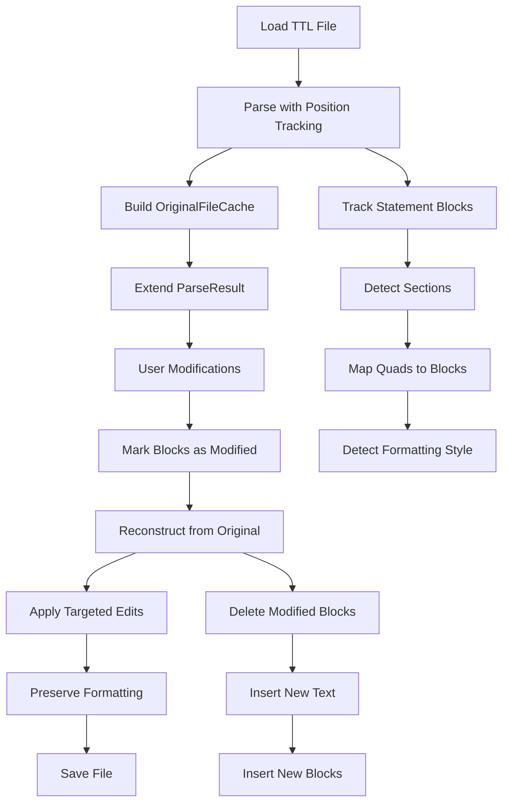

# Source Preservation Implementation Plan

## Overview

Replace the current post-processing approach with source text preservation that tracks original file positions for each statement block. This enables:
- Perfect idempotent round-trips (file → modify → save → modify back → save = identical file)
- Original formatting preservation (indentation, line breaks, comments)
- Section structure preservation
- Import ordering preservation
- No blank node inlining issues (original format is preserved)

## Architecture



## Implementation Phases

### Phase 1: Core Data Structures
**File**: `src/rdf/sourcePreservation.ts` (new file)

Create interfaces and types:
- `TextPosition` - character/line position tracking
- `StatementType` - Header, Ontology, Class, Property types
- `FormattingStyle` - detected formatting (indent, line endings, spacing)
- `StatementBlock` - complete statement with position and quads
- `Section` - section grouping with structure detection
- `OriginalFileCache` - complete file cache with all metadata
- `ParseResultWithSource` - extended ParseResult

### Phase 2: Position-Aware Parsing (Turtle)
**File**: `src/rdf/sourcePreservation.ts`

Implement `parseTurtleWithPositions()`:
- Line-by-line parsing with character offset tracking
- Statement block detection (start/end positions)
- Section detection based on statement type transitions
- Formatting style detection (indent size, line endings)
- Header section tracking (@prefix, @base)
- Quad-to-block mapping

Key functions:
- `detectStatementTypeFromLine()` - identify statement type
- `detectFormattingStyle()` - analyze formatting patterns
- `detectBlockFormatting()` - per-block formatting
- `matchQuadsToBlocks()` - associate parsed quads with blocks

### Phase 3: Statement Type Detection
**File**: `src/rdf/sourcePreservation.ts`

Implement statement classification:
- Header: `@prefix`, `@base` declarations
- Ontology: `owl:Ontology` + `owl:imports` statements
- Class: `owl:Class` definitions
- AnnotationProperty: `owl:AnnotationProperty`
- ObjectProperty: `owl:ObjectProperty`
- DatatypeProperty: `owl:DatatypeProperty`
- Other: unclassified statements

Section structure detection:
- Track section type transitions
- Count occurrences of each section type
- Mark `hasStructure: false` if duplicate section types exist

### Phase 4: Integration with Parser
**File**: `src/parser.ts`

Modify parsing functions:
- Extend `parseRdfToGraph()` to call position-aware parsing for Turtle
- Return `ParseResultWithSource` when source preservation is available
- Keep backward compatibility (fallback to current approach)

Key changes:
- Modify `parseTtlToGraph()` to use `parseTurtleWithPositions()`
- Store `OriginalFileCache` in extended `ParseResult`
- Update `buildParseResultFromStore()` to accept optional cache

### Phase 5: Modification Tracking
**File**: `src/parser.ts` and `src/rdf/sourcePreservation.ts`

Track modifications to blocks:
- Mark blocks as `isModified: true` when quads change
- Mark blocks as `isNew: true` for new statements
- Mark blocks as `isDeleted: true` for removed statements
- Update block quads when store changes

Modify existing store update functions:
- `updateLabelInStore()` - mark corresponding block as modified
- `addNodeToStore()` - create new block, mark as new
- `removeNodeFromStore()` - mark block as deleted
- Similar for properties and edges

### Phase 6: Text Reconstruction
**File**: `src/rdf/sourcePreservation.ts`

Implement `reconstructFromOriginalText()`:
- Apply deletions (remove text at block positions)
- Apply modifications (replace text at block positions)
- Insert new blocks in appropriate sections
- Preserve blank lines and comments between blocks

Key functions:
- `findAlphabeticalInsertPosition()` - find insertion point in section
- `insertAtPosition()` - insert with proper spacing
- Handle files with no structure (append at end)

### Phase 7: Formatting-Preserving Serialization
**File**: `src/rdf/sourcePreservation.ts`

Implement `serializeBlockToTurtle()`:
- Serialize quads to Turtle using N3 Writer
- Apply detected formatting style (indentation, line breaks)
- Preserve original formatting patterns when possible

Key functions:
- `applyFormattingStyle()` - reformat serialized text
- `preserveIndentation()` - maintain original indent levels
- `preserveLineBreaks()` - maintain original line structure

### Phase 8: Replace storeToTurtle
**File**: `src/parser.ts`

Modify `storeToTurtle()`:
- Check if `OriginalFileCache` is available
- If yes: use `reconstructFromOriginalText()`
- If no: fallback to current approach (post-processing)
- Maintain backward compatibility

### Phase 9: Integration with Main App
**File**: `src/main.ts`

Update file loading and saving:
- Store `OriginalFileCache` when loading files
- Pass cache to modification functions
- Use cache-aware `storeToTurtle()` when saving
- Update `originalTtlString` handling

Key changes:
- In `loadTtlAndRender()`: store cache from parse result
- In `saveTtl()`: use cache-aware serialization
- Track cache across file operations

### Phase 10: Stubs for Other Formats
**Files**: `src/rdf/sourcePreservation.ts`

Create stub functions with TODOs:
- `parseRdfXmlWithPositions()` - TODO: Implement RDF/XML position tracking
- `parseJsonLdWithPositions()` - TODO: Implement JSON-LD position tracking
- `parseNTriplesWithPositions()` - TODO: Implement N-Triples position tracking
- `reconstructFromOriginalRdfXml()` - TODO: Implement RDF/XML reconstruction
- `reconstructFromOriginalJsonLd()` - TODO: Implement JSON-LD reconstruction
- `reconstructFromOriginalNTriples()` - TODO: Implement N-Triples reconstruction

Each stub should:
- Accept same parameters as Turtle version
- Return compatible structure
- Include TODO comment explaining future implementation
- Log warning when called (format not yet supported)

### Phase 11: Testing
**Files**: `tests/unit/sourcePreservation.test.ts` (new), `tests/unit/roundTrip.test.ts` (update)

Unit tests:
- Position tracking accuracy
- Section detection (with/without structure)
- Formatting style detection
- Block matching to quads
- Text reconstruction (modify, delete, insert)
- Formatting preservation

Integration tests:
- Idempotent round-trip test (load → modify → save → modify back → save = identical)
- Section preservation test
- Import ordering preservation test
- Blank node format preservation test

## File Structure

```
src/
  rdf/
    sourcePreservation.ts     # Core implementation (NEW)
    parseRdfToQuads.ts        # Existing (no changes)
  parser.ts                   # Modified (integrate source preservation)
  main.ts                     # Modified (use cache-aware functions)
  turtlePostProcess.ts        # Keep for fallback (deprecated path)

tests/
  unit/
    sourcePreservation.test.ts  # NEW
    roundTrip.test.ts           # UPDATE (use new approach)
  fixtures/
    test-round-trip.ttl         # Existing test file
```

## Key Design Decisions

1. **Position Tracking**: Manual line-by-line parsing with character offset tracking (N3 Parser doesn't provide positions)

2. **Statement Blocks**: Track entire multi-line definitions as single blocks (preserves formatting)

3. **Section Detection**: Based on statement type transitions, not section dividers

4. **Formatting Preservation**: Detect and apply original formatting style during serialization

5. **Backward Compatibility**: Fallback to current post-processing if cache unavailable

6. **Modification Tracking**: Mark blocks as modified/new/deleted, reconstruct from original

7. **Blank Lines**: Excluded from block positions but preserved between blocks

8. **Comments**: Preserved in exact positions (included in block positions)

## Success Criteria

- [ ] Idempotent round-trip test passes (file identical after modify → save → modify back → save)
- [ ] Original formatting preserved (indentation, line breaks, spacing)
- [ ] Section structure preserved (or detected and maintained)
- [ ] Import ordering preserved
- [ ] Blank node format preserved (no `_:df_X_Y` issues)
- [ ] All existing tests pass (backward compatibility)
- [ ] Performance acceptable for large files

## Migration Strategy

1. Implement alongside existing code (no breaking changes)
2. Enable for Turtle files first
3. Fallback to post-processing if cache unavailable
4. Gradually migrate modification functions to use cache
5. Remove post-processing once fully migrated (future)

## Risk Mitigation

- **Complexity**: Start with simple cases (single-line statements), expand to multi-line
- **Performance**: Cache original file once, compute positions on-demand
- **Edge Cases**: Comprehensive test coverage for various file structures
- **Backward Compatibility**: Maintain fallback path for files without cache